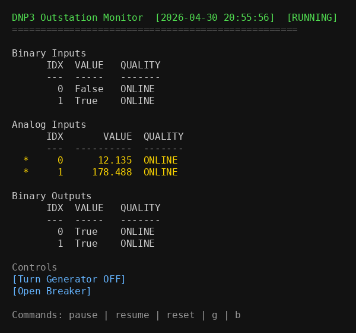
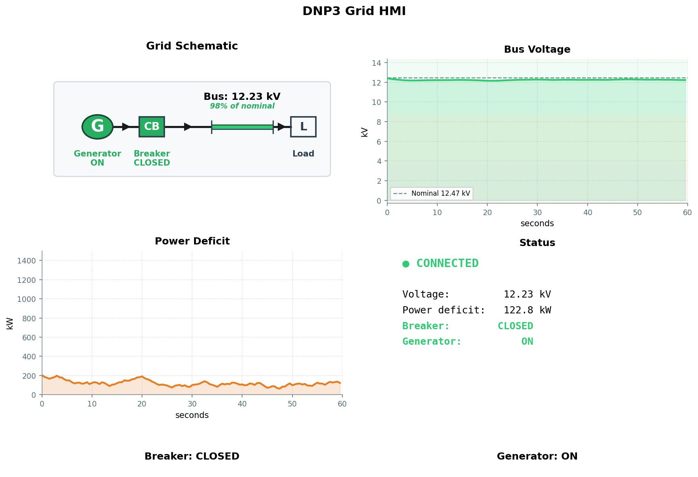

# Grid Watch

A simplified simulation of an electrical grid outstation with DNP3 process control.
Designed to serve as a target for [Caldera for OT](https://github.com/mitre/caldera-ot).

For an overview, read the writeup: [Caldera for OT — Grid Watch: A Virtual DNP3 Electrical Grid Sandbox](https://medium.com/@mitrecaldera/caldera-for-ot-grid-watch-a-virtual-dnp3-electrical-grid-sandbox-761e8c83ab77).

## Authors

Created by University of Hawaii at Manoa students:
Yueming Guo, Lewen Lin, Myra Angelica Ortigosa, and Justin Smith

In collaboration with Caldera for OT ([ot@mitre.org](mailto:ot@mitre.org)).



## Description

This simulator provides a DNP3-enabled electrical grid outstation for testing and
training. It includes a DNP3 outstation server and an HMI dashboard, useful for practicing
protocol interactions without physical hardware.

## Getting Started

### Dependencies

* Python 3.11+
   * Requires the tkinter package ([Installation - TKDocs](https://tkdocs.com/tutorial/install.html))
* dnp3py, pyyaml, matplotlib (see requirements.txt)

### Installation

1. Clone this repo:
```bash
git clone https://github.com/mitre/grid-watch.git
cd grid-watch
```

2. Install dependencies:
```bash
pip install -r requirements.txt
```

3. Run the simulator:
```bash
python run.py
```

## Usage

```bash
python run.py
```

Select a component from the menu:

* **1** - Start the DNP3 outstation server (`0.0.0.0:20000`)
* **2** - Launch the matplotlib HMI dashboard (requires outstation running)
* **3** - Run the DNP3 test client

The outstation listens on TCP port 20000 and accepts connections from any standard DNP3 master.
[Caldera for OT](https://github.com/mitre/caldera-ot) with its DNP3 plugin is recommended
for adversary emulation, but any DNP3 client (dnp3-actions, pyDNP3, etc.) will work.



## Caldera OT Integration

The repo ships a fact source and four adversary profiles for use with [Caldera for OT](https://github.com/mitre/caldera-ot) and its DNP3 plugin.

### Setup

The files below are templates - copy them into your Caldera DNP3 plugin directory and adjust values (host, link addresses) for your environment:

| Template | Destination |
|---|---|
| `docs/sources/grid-simulator-facts.yml` | `plugins/dnp3/data/sources/` |
| `docs/adversaries/dnp3-reconnaissance.yml` | `plugins/dnp3/data/adversaries/` |
| `docs/adversaries/dnp3-unauthorized-control.yml` | `plugins/dnp3/data/adversaries/` |
| `docs/adversaries/dnp3-grid-disruption.yml` | `plugins/dnp3/data/adversaries/` |
| `docs/adversaries/dnp3-grid-attack-and-verify.yml` | `plugins/dnp3/data/adversaries/` |

Restart Caldera after copying so it picks up the new files.

### Scenarios

| Adversary | Scenario | Description |
|---|---|---|
| DNP3 Reconnaissance | [Scenario 1](docs/scenarios/scenario_1_reconnaissance.md) | Read-only enumeration of all outstation data points |
| DNP3 Unauthorized Control | [Scenario 2](docs/scenarios/scenario_2_unauthorized_control.md) | Trip breaker and stop generator via `DIRECT_OPERATE` |
| DNP3 Grid Disruption | [Scenario 3](docs/scenarios/scenario_3_grid_disruption.md) | Multi-phase attack using `DIRECT_OPERATE` and `SELECT_BEFORE_OPERATE` |
| DNP3 Grid Attack and Verify | [Scenario 4](docs/scenarios/scenario_4_grid_attack_and_verify.md) | Full operate + read-back verification chain |

### Docker

The `docker/` directory contains a Docker Compose setup that brings up the outstation, a Caldera server with the DNP3 plugin, and a Sandcat agent on a shared network:

```bash
docker compose -f docker/docker-compose.yml up --build
```

* **Caldera UI**: http://localhost:8888 (login: `admin` / `admin`)
* **DNP3 Outstation**: `localhost:20000`

## DNP3 Point Map

### Analog Inputs (Read)

| Index | Name         | Description        |
|-------|--------------|--------------------|
| 0     | BusVoltage   | Bus voltage (kV)   |
| 1     | PowerDeficit | Power deficit (kW) |

### Binary Inputs (Read)

| Index | Name          | Description                   |
|-------|---------------|-------------------------------|
| 0     | BreakerStatus | Breaker state (true = closed) |
| 1     | GenStatus     | Generator state (true = on)   |

### Binary Outputs (Read/Write)

| Index | Name           | Description                   |
|-------|----------------|-------------------------------|
| 0     | BreakerControl | Breaker state (true = closed) |
| 1     | GenControl     | Generator state (true = on)   |

## Running Tests

```bash
pytest tests/ -v
```

## Custom DNP3 Read

The dnp3py library currently lacks support for qualifier `0x17` (indexed-count format),
which is the format this outstation uses for all object responses. This limitation was
tracked in [craigpnnl/dnp3py issue #6](https://github.com/craigpnnl/dnp3py/issues/6).
To work around it, `dnp3-sim/dnp3_frame.py` handles link-layer framing and a custom
response parser was written in `dnp3-sim/dnp3_read.py` that handles the indexed-count
encoding directly.

## Acknowledgements

* [Caldera](https://github.com/apache/caldera) - Automated Adversary Emulation Platform
* [Caldera for OT](https://github.com/mitre/caldera-ot) - Caldera for OT Plugins & Capabilities
* [dnp3py](https://github.com/craigpnnl/dnp3py) - pure-Python DNP3 library used for the outstation and master implementations
* [MITRE ATT&CK for ICS](https://attack.mitre.org/matrices/ics/) - threat model and tactic/technique taxonomy used in scenario design

Approved for public release. Distribution unlimited PRS 26-1239.
