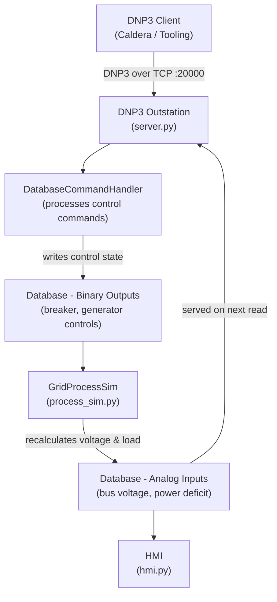

# Architecture

The simulator runs as a single Python process with four cooperating components:

## Data Flow

1. Caldera (or any DNP3 master) connects to the outstation on TCP port 20000
2. A control request (Operate) is dispatched to `DatabaseCommandHandler`
3. The handler writes the new binary output state (e.g. breaker tripped, generator off)
4. `GridProcessSim` reads the updated controls and recalculates grid state using an EMA model
5. Recalculated analog inputs (bus voltage, power deficit) are written back to the database
6. Subsequent DNP3 reads (Integrity Poll, Read All) return the updated values
7. The HMI reflects the current database state in real time
