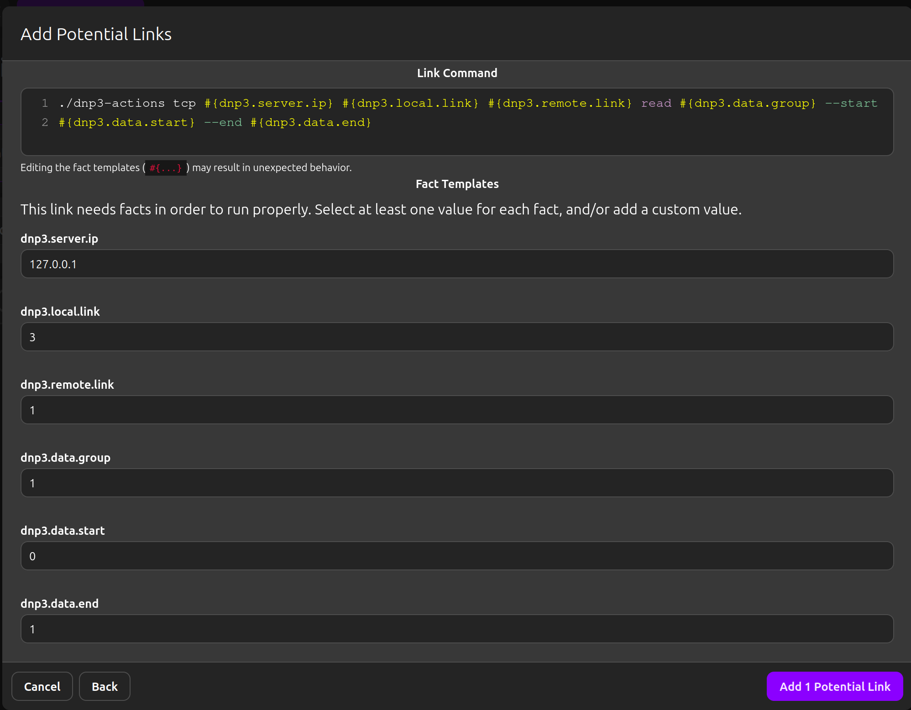
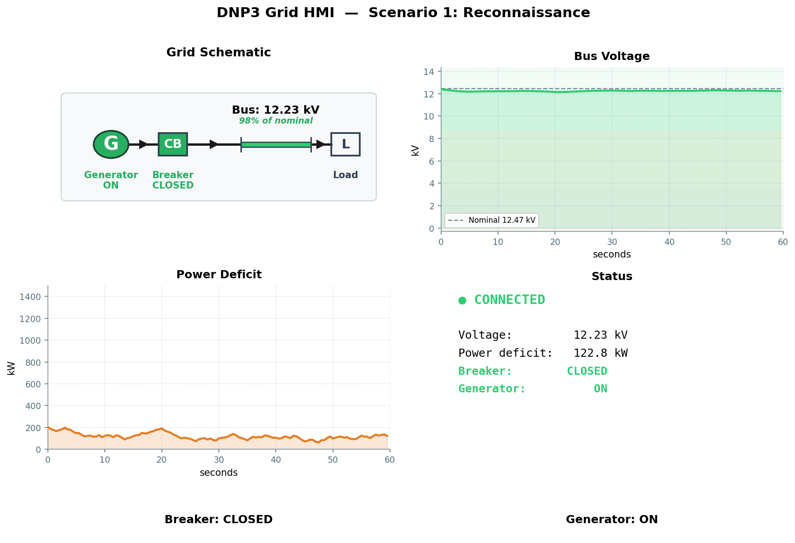

# Scenario 1: Reconnaissance

## Overview

| Field | Value |
|---|---|
| **Tactic** | Collection, Discovery |
| **Techniques** | [T0802 - Automated Collection](https://attack.mitre.org/techniques/T0802/), [T0861 - Point & Tag Identification](https://attack.mitre.org/techniques/T0861/) |
| **Target** | DNP3 outstation on TCP :20000 |
| **Impact** | None - read-only operations only |

## Objective

Discover all data points exposed by the DNP3 outstation without issuing any
control commands. An adversary can fully enumerate the device's data model
using standard read operations that are indistinguishable from legitimate
master station traffic.

## Fact Variables

| Fact | Description | Type | Default |
|------|-------------|------|---------|
| `dnp3.server.ip` | IP address of the outstation | string | `127.0.0.1` |
| `dnp3.local.link` | Link-layer address of the master | int | `3` |
| `dnp3.remote.link` | Link-layer address of the outstation | int | `1` |
| `dnp3.data.group` | DNP3 object group to read | int | `1` |
| `dnp3.data.start` | First index in the read range | int | `0` |
| `dnp3.data.end` | Last index in the read range | int | `1` |

## Caldera Operation

Load `docs/sources/grid-simulator-facts.yml` as the fact source, then
build an operation using the following abilities in order:

| Step | Ability | Ability ID | Facts Used |
|------|---------|------------|------------|
| 1 | DNP3 (TCP) - Integrity Poll | `1d412b2f-f4ae-3ed2-822e-55a4490a7d1a` | `dnp3.server.ip`, `dnp3.local.link`, `dnp3.remote.link` |
| 2 | DNP3 (TCP) - Read All | `8d0889f8-6801-4986-baaf-83622bf08ced` | `dnp3.server.ip`, `dnp3.local.link`, `dnp3.remote.link`, `dnp3.data.group` |
| 3 | DNP3 (TCP) - Read | `689ee6dd-9f24-352f-90da-8d06fae7d19c` | `dnp3.server.ip`, `dnp3.local.link`, `dnp3.remote.link`, `dnp3.data.group`, `dnp3.data.start`, `dnp3.data.end` |

## Expected Observations

- Outstation accepts TCP connection without authentication (T0861)
- Integrity poll returns all static data - 2 binary inputs, 2 analog inputs, 2 binary outputs
- `AI[0]` = bus voltage (~10–12 kV with breaker closed and generator on)
- `AI[1]` = power deficit (~200–800 kW depending on generator state)
- `BO[0]` = breaker control, `BO[1]` = generator control - both readable without access control (T0802)
- Step 3: Targeted read of group 1, indices 0–1 enumerates specific binary input points (T0861)
- No alarms triggered by read-only operations

## See Also

- [Caldera for OT](https://github.com/mitre/caldera-ot)
- [ATT&CK for ICS - T0802](https://attack.mitre.org/techniques/T0802/)
- [ATT&CK for ICS - T0861](https://attack.mitre.org/techniques/T0861/)
