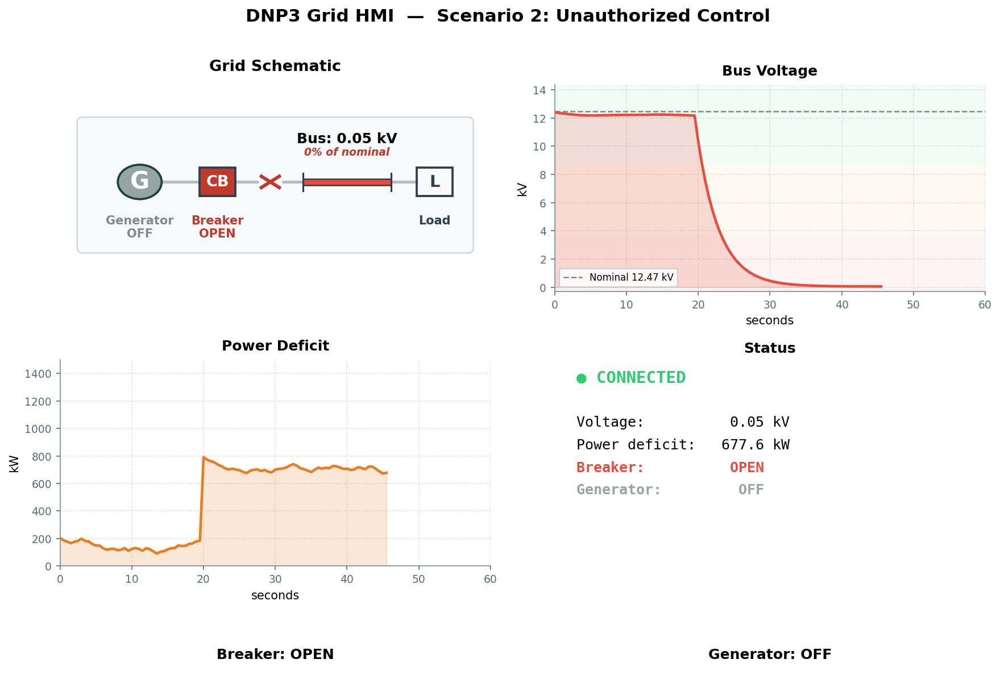

# Scenario 2: Unauthorized Control

## Overview

| Field | Value |
|---|---|
| **Tactic** | Impair Process Control |
| **Techniques** | [T0855 - Unauthorized Command Message](https://attack.mitre.org/techniques/T0855/), [T0831 - Manipulation of Control](https://attack.mitre.org/techniques/T0831/) |
| **Target** | Grid Watch outstation over DNP3 |
| **Impact** | Bus voltage collapse, full power deficit |

## Objective

Send DIRECT_OPERATE commands to trip the breaker and stop the generator. The
outstation runs both without authentication and the grid simulation reacts at
once: bus voltage collapses and the power deficit rises.

## Fact Variables

| Fact | Description | Type | Default |
|------|-------------|------|---------|
| `dnp3.server.ip` | IP address of the outstation | string | `127.0.0.1` |
| `dnp3.local.link` | Link-layer address of the master | int | `3` |
| `dnp3.remote.link` | Link-layer address of the outstation | int | `1` |
| `dnp3.operate.indices` | Binary output indices to operate (comma-separated) | string | `0` (breaker), `1` (generator) |
| `dnp3.operate.mode` | DNP3 operate mode | string | `DIRECT_OPERATE` |
| `dnp3.operate.type` | Control relay output block type | string | `LATCH_OFF` |
| `dnp3.operate.tcc` | Trip-close code | string | `NUL` |

## Caldera Operation

Load `docs/sources/grid-watch-simulator-facts.yml` as the fact source, then
build an operation using the following abilities in order:

| Step | Ability | Ability ID | Facts Used |
|------|---------|------------|------------|
| 1 | DNP3 (TCP) - Integrity Poll | `1d412b2f-f4ae-3ed2-822e-55a4490a7d1a` | Baseline read |
| 2 | DNP3 (TCP) - Operate | `5a073c32-e022-3724-85ad-7192464287b8` | `indices=0`, `mode=DIRECT_OPERATE`, `type=LATCH_OFF`, `tcc=NUL` |
| 3 | DNP3 (TCP) - Operate | `5a073c32-e022-3724-85ad-7192464287b8` | `indices=1`, `mode=DIRECT_OPERATE`, `type=LATCH_OFF`, `tcc=NUL` |
| 4 | DNP3 (TCP) - Integrity Poll | `1d412b2f-f4ae-3ed2-822e-55a4490a7d1a` | Confirm post-attack state |

## Expected Observations

- The breaker trips: `BO[0]` goes to LATCH_OFF and `AI[0]` collapses from roughly 10 to 12 kV down to about 0.05 kV.
- The generator stops: `BO[1]` goes to LATCH_OFF and `AI[1]` rises to full load, about 800+ kW.
- The integrity poll confirms the disrupted grid state.
- The outstation accepts every command without authentication.

## See Also

- [Caldera for OT](https://github.com/mitre/caldera-ot)
- [ATT&CK for ICS - T0855](https://attack.mitre.org/techniques/T0855/)
- [ATT&CK for ICS - T0831](https://attack.mitre.org/techniques/T0831/)
