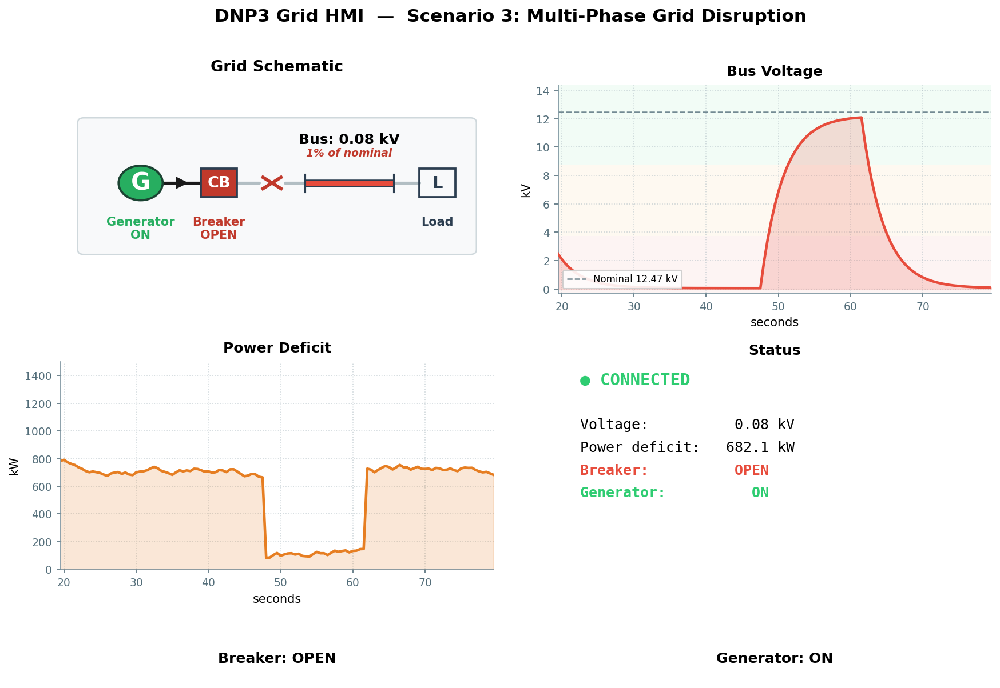

# Scenario 3: Grid Disruption

## Overview

| Field | Value |
|---|---|
| **Tactic** | Impact |
| **Techniques** | [T0826 - Loss of Availability](https://attack.mitre.org/techniques/T0826/), [T0827 - Loss of Control](https://attack.mitre.org/techniques/T0827/), [T0831 - Manipulation of Control](https://attack.mitre.org/techniques/T0831/) |
| **Target** | DNP3 outstation on TCP :20000 |
| **Impact** | Multi-phase grid destabilization via both DIRECT_OPERATE and SELECT_BEFORE_OPERATE |

## Objective

A multi-phase attack that destabilizes the grid and demonstrates two distinct
DNP3 command paths - DIRECT_OPERATE and SELECT_BEFORE_OPERATE (SBO) - both
accepted by the outstation without authentication.

## Fact Variables

| Fact | Description | Type | Default |
|------|-------------|------|---------|
| `dnp3.server.ip` | IP address of the outstation | string | `127.0.0.1` |
| `dnp3.local.link` | Link-layer address of the master | int | `3` |
| `dnp3.remote.link` | Link-layer address of the outstation | int | `1` |
| `dnp3.operate.indices` | Binary output indices to operate (comma-separated) | string | `0` (breaker), `1` (generator) |
| `dnp3.operate.mode` | DNP3 operate mode | string | `DIRECT_OPERATE`, `SELECT_BEFORE_OPERATE` |
| `dnp3.operate.type` | Control relay output block type | string | `LATCH_ON`, `LATCH_OFF` |
| `dnp3.operate.tcc` | Trip-close code | string | `NUL` |

## Caldera Operation

Load `docs/sources/grid-simulator-facts.yml` as the fact source, then
build an operation using the following abilities in order:

| Step | Ability | Ability ID | Key Facts | Phase |
|------|---------|------------|-----------|-------|
| 1 | DNP3 (TCP) - Integrity Poll | `1d412b2f-f4ae-3ed2-822e-55a4490a7d1a` | - | Baseline |
| 2 | DNP3 (TCP) - Operate | `5a073c32-e022-3724-85ad-7192464287b8` | `indices=1`, `mode=DIRECT_OPERATE`, `type=LATCH_OFF` | 1 - Stop generator |
| 3 | DNP3 (TCP) - Operate | `5a073c32-e022-3724-85ad-7192464287b8` | `indices=0`, `mode=DIRECT_OPERATE`, `type=LATCH_OFF` | 2 - Trip breaker |
| 4 | DNP3 (TCP) - Operate | `5a073c32-e022-3724-85ad-7192464287b8` | `indices=0`, `mode=DIRECT_OPERATE`, `type=LATCH_ON` | Restore - Close breaker |
| 5 | DNP3 (TCP) - Operate | `5a073c32-e022-3724-85ad-7192464287b8` | `indices=1`, `mode=DIRECT_OPERATE`, `type=LATCH_ON` | Restore - Start generator |
| 6 | DNP3 (TCP) - Operate | `5a073c32-e022-3724-85ad-7192464287b8` | `indices=0`, `mode=SELECT_BEFORE_OPERATE`, `type=LATCH_OFF` | 3 - SBO trip breaker |
| 7 | DNP3 (TCP) - Integrity Poll | `1d412b2f-f4ae-3ed2-822e-55a4490a7d1a` | - | Confirm final state |

## Expected Observations

- Phase 1 (Step 2): Generator disabled (T0831) - voltage collapses to ~0.05 kV, deficit rises to full load
- Phase 2 (Step 3): Breaker opened (T0826) - voltage remains at ~0.05 kV, full blackout confirmed
- Restore (Steps 4–5): Grid recovers to normal operating range
- Phase 3 (Step 6): SELECT_BEFORE_OPERATE accepted without challenge (T0827) - second voltage collapse confirmed
- Step 7: Final integrity poll shows disrupted state
- All 5 DIRECT_OPERATE and 1 SELECT_BEFORE_OPERATE commands accepted without authentication

## See Also

- [Caldera for OT](https://github.com/mitre/caldera-ot)
- [ATT&CK for ICS - T0826](https://attack.mitre.org/techniques/T0826/)
- [ATT&CK for ICS - T0827](https://attack.mitre.org/techniques/T0827/)
- [ATT&CK for ICS - T0831](https://attack.mitre.org/techniques/T0831/)
