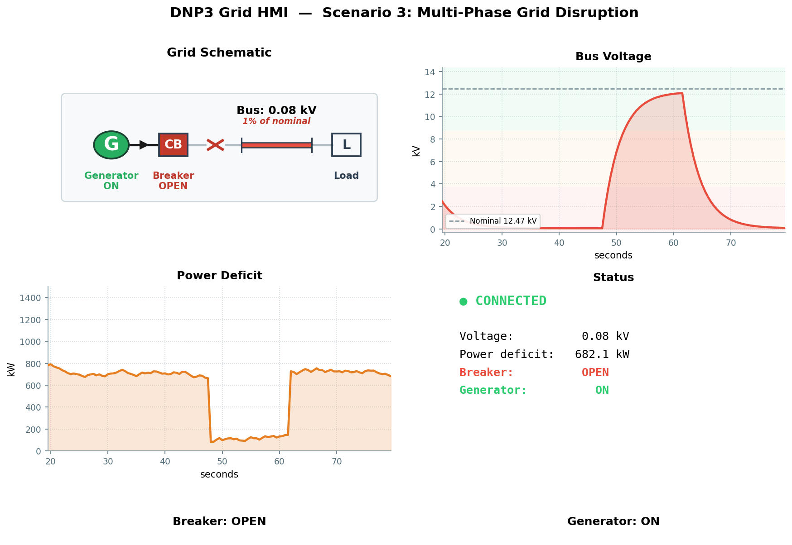

# Scenario 3: Grid Disruption

## Overview

| Field | Value |
|---|---|
| **Tactic** | Impact |
| **Techniques** | [T0826 - Loss of Availability](https://attack.mitre.org/techniques/T0826/), [T0827 - Loss of Control](https://attack.mitre.org/techniques/T0827/), [T0831 - Manipulation of Control](https://attack.mitre.org/techniques/T0831/) |
| **Target** | Grid Watch outstation over DNP3 |
| **Impact** | Multi-phase grid destabilization via both DIRECT_OPERATE and SELECT_BEFORE_OPERATE |

## Objective

Run a multi-step sequence over both DNP3 command paths, DIRECT_OPERATE and
SELECT_BEFORE_OPERATE. Stop the generator and trip the breaker, restore both,
then trip the breaker again over SELECT_BEFORE_OPERATE. The outstation runs
every command without authentication.

## Fact Variables

| Fact | Description | Type | Default |
|------|-------------|------|---------|
| `dnp3.server.ip` | IP address of the outstation | string | `127.0.0.1` |
| `dnp3.local.link` | Link-layer address of the master | int | `3` |
| `dnp3.remote.link` | Link-layer address of the outstation | int | `1` |
| `dnp3.operate.indices` | Binary output indices to operate (comma-separated) | string | `0` (breaker), `1` (generator) |
| `dnp3.operate.mode` | DNP3 operate mode | string | `DIRECT_OPERATE`, `SELECT_BEFORE_OPERATE` |
| `dnp3.operate.type` | Control relay output block type | string | `LATCH_ON`, `LATCH_OFF` |
| `dnp3.operate.tcc` | Trip-close code | string | `NUL` |

## Caldera Operation

Load `docs/sources/grid-watch-simulator-facts.yml` as the fact source, then
build an operation using the following abilities in order:

| Step | Ability | Ability ID | Facts Used |
|------|---------|------------|------------|
| 1 | DNP3 (TCP) - Integrity Poll | `1d412b2f-f4ae-3ed2-822e-55a4490a7d1a` | baseline |
| 2 | DNP3 (TCP) - Operate | `5a073c32-e022-3724-85ad-7192464287b8` | `indices=1`, `mode=DIRECT_OPERATE`, `type=LATCH_OFF` (stop generator) |
| 3 | DNP3 (TCP) - Operate | `5a073c32-e022-3724-85ad-7192464287b8` | `indices=0`, `mode=DIRECT_OPERATE`, `type=LATCH_OFF` (trip breaker) |
| 4 | DNP3 (TCP) - Operate | `5a073c32-e022-3724-85ad-7192464287b8` | `indices=0`, `mode=DIRECT_OPERATE`, `type=LATCH_ON` (restore, close breaker) |
| 5 | DNP3 (TCP) - Operate | `5a073c32-e022-3724-85ad-7192464287b8` | `indices=1`, `mode=DIRECT_OPERATE`, `type=LATCH_ON` (restore, start generator) |
| 6 | DNP3 (TCP) - Operate | `5a073c32-e022-3724-85ad-7192464287b8` | `indices=0`, `mode=SELECT_BEFORE_OPERATE`, `type=LATCH_OFF` (SBO trip breaker) |
| 7 | DNP3 (TCP) - Integrity Poll | `1d412b2f-f4ae-3ed2-822e-55a4490a7d1a` | confirm final state |

## Expected Observations

- The generator stops and voltage collapses to about 0.05 kV as the deficit rises to full load.
- The breaker opens and voltage stays at about 0.05 kV, a full blackout.
- The restore commands bring the grid back to its normal operating range.
- SELECT_BEFORE_OPERATE runs without challenge and voltage collapses a second time.
- The final integrity poll shows the disrupted state.
- The outstation accepts every operate command without authentication, over both DIRECT_OPERATE and SELECT_BEFORE_OPERATE.

## See Also

- [Caldera for OT](https://github.com/mitre/caldera-ot)
- [ATT&CK for ICS - T0826](https://attack.mitre.org/techniques/T0826/)
- [ATT&CK for ICS - T0827](https://attack.mitre.org/techniques/T0827/)
- [ATT&CK for ICS - T0831](https://attack.mitre.org/techniques/T0831/)
