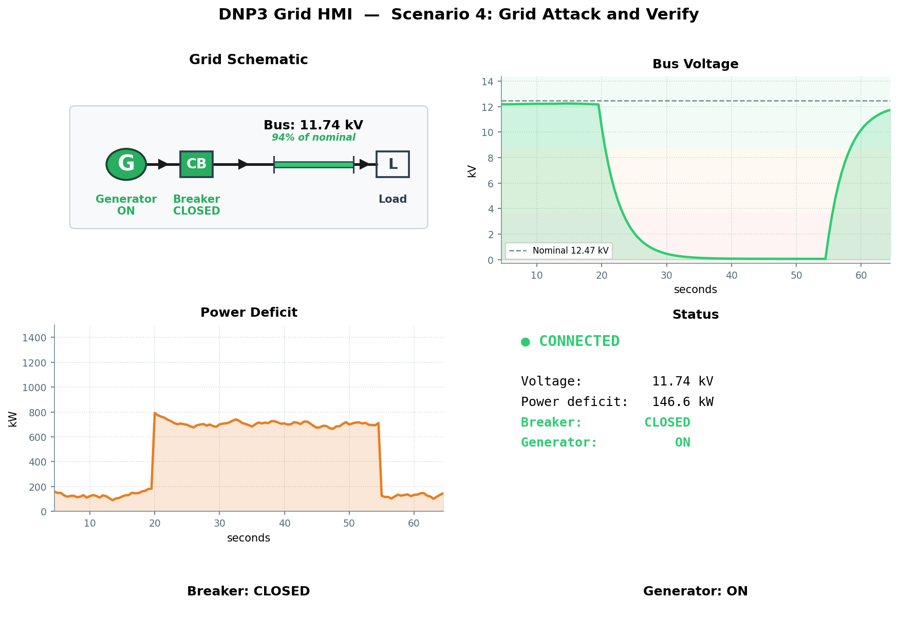

# Scenario 4: Grid Attack and Verify

## Overview

| Field | Value |
|---|---|
| **Tactic** | Impact, Collection, Inhibit Response Function |
| **Techniques** | [T0855 - Unauthorized Command Message](https://attack.mitre.org/techniques/T0855/), [T0861 - Point & Tag Identification](https://attack.mitre.org/techniques/T0861/), [T0816 - Device Restart/Shutdown](https://attack.mitre.org/techniques/T0816/) |
| **Target** | Grid Watch outstation over DNP3 |
| **Impact** | Operate breaker/generator controls then verify state changes via read-back |

## Objective

Operate the breaker and generator controls, then read the outstation back to
confirm the change. The operate command and every read run without
authentication.

## Fact Variables

| Fact | Description | Type | Default |
|------|-------------|------|---------|
| `dnp3.server.ip` | IP address of the outstation | string | `127.0.0.1` |
| `dnp3.local.link` | Link-layer address of the master | int | `3` |
| `dnp3.remote.link` | Link-layer address of the outstation | int | `1` |
| `dnp3.operate.indices` | Binary output indices to operate (comma-separated) | string | `0` (breaker), `1` (generator) |
| `dnp3.operate.mode` | DNP3 operate mode | string | `DIRECT_OPERATE` |
| `dnp3.operate.type` | Control relay output block type | string | `LATCH_ON`, `LATCH_OFF` |
| `dnp3.operate.tcc` | Trip-close code | string | `NUL` |
| `dnp3.data.group` | DNP3 object group to read | int | `1` |
| `dnp3.data.start` | First index in the read range | int | `0` |
| `dnp3.data.end` | Last index in the read range | int | `1` |

## Caldera Operation

Load `docs/sources/grid-watch-simulator-facts.yml` as the fact source, then
build an operation using the following abilities in order:

| Step | Ability | Ability ID | Facts Used |
|------|---------|------------|------------|
| 1 | DNP3 (TCP) - Operate | `5a073c32-e022-3724-85ad-7192464287b8` | `dnp3.operate.indices`, `dnp3.operate.mode`, `dnp3.operate.type`, `dnp3.operate.tcc` |
| 2 | DNP3 (TCP) - Read | `689ee6dd-9f24-352f-90da-8d06fae7d19c` | `dnp3.data.group`, `dnp3.data.start`, `dnp3.data.end` |
| 3 | DNP3 (TCP) - Read All | `8d0889f8-6801-4986-baaf-83622bf08ced` | `dnp3.data.group` |
| 4 | DNP3 (TCP) - Integrity Poll | `1d412b2f-f4ae-3ed2-822e-55a4490a7d1a` | `dnp3.server.ip`, `dnp3.local.link`, `dnp3.remote.link` |
| 5 | DNP3 (TCP) - Warm Restart | `fe8403ab-e37c-40b6-8f0e-6b0b4192f675` | `dnp3.server.ip`, `dnp3.local.link`, `dnp3.remote.link` |

## Expected Observations

- The outstation accepts the control command without authentication and the breaker or generator state changes.
- The targeted read confirms the operated point reflects the new state.
- Read All returns every point in the group with the full updated picture.
- The integrity poll shows the updated binary outputs, binary inputs, and analog inputs.
- The outstation accepts the warm restart without authentication, reinitializes, and returns to its default state.

## See Also

- [Caldera for OT](https://github.com/mitre/caldera-ot)
- [ATT&CK for ICS - T0855](https://attack.mitre.org/techniques/T0855/)
- [ATT&CK for ICS - T0861](https://attack.mitre.org/techniques/T0861/)
- [ATT&CK for ICS - T0816](https://attack.mitre.org/techniques/T0816/)
